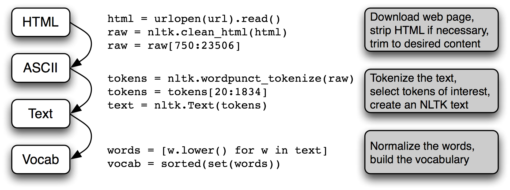

# A.I. Legal Research Assistant

[__Fall 2017 Galvanize Data Science Immersive__](https://www.galvanize.com/austin)

An Investigation of legal research using the court cases scraped with Python's Beautiful Soup from FindLaw.com.

__Abstract:__ This project uses over 5,000 U.S. Supreme Court and U.S. Circuit Courts of Appeals' immigration cases. These were scraped using Python's Beautiful Soup from FindLaw.com on Amazon AMIs and S3. 

__Results:__ Built a fully functioning legal search engine able to take in free text queries and return relevant results based on cosine similarity built on Tf-IDF weights. Additionally, each result has 3 related court cases based on Networkx graph recommendations. 

See this work as a presentation in [Google Slides](https://docs.google.com/presentation/d/18PTXyDBYRlwHm7m53Z7BVN3Ix4OfCYLWLPpcTeVV6Is/edit?usp=sharing).

[See the video](https://www.youtube.com/watch?v=o5R0kOjtzwA&index=5&list=PLxtztEze-DRfCd2LY4IRytALcjpJQp0WC) of this talk.

## Motivation: 

Any U.S. citizen is entitled to legal representation under the law. The same is not true for non-citizens. In immigration court, over 80% of all defendants go unrepresented simply because they cannot afford a lawyer. Legal research stands among the highest costs for defendants. To illustrate, below are the national average of hourly rates for divorce attorneys: 

 

  Figure 1. Distribution of hourly rates for divorce attorneys, https://www.nolo.com/legal-encyclopedia/ctp/cost-of-divorce.html

## Demo: 
This is where A.I. steps in. Although recent advances in machine learning have affected most major industries, the legal market is notably absent, with a few exceptions. ROSS A.I. is a startup company that has built a search engine built to optimize legal research; however they are solely focused on bankruptcy law. With this project, I intend to build upon their work and expand this ML powered search engine to new areas like immigration law. Below is an example of how it works: 

 

## The Challenge: 

One of the biggest hurdles to overcome is how to access all the relevant data. Using $15 per search engines like Westlaw and LexisNexis are not feasible, however convenient their aggregation of all relevant law types may be. Alternatively, it is possible to set up web-scrapers to access and store the data held piecemeal on many government websites and free legal resource sites like FindLaw.

In order to run a live demo by January 2018, my goal is to team up with a Galvanize web-development student to help build the front and backend of a website. The goal is to have a simple, yet useful search engine with features such as:

- Sorting by: Similarity/ Relevance, Date published, ranking of source law, etc. 
- Preview: See a clip of the document before clicking 
- Follow a search 
- Thumbs up/down (for feedback and potential recommender feature) 
- Categorical scale of positive or negative language

Next comes the data architecture problem. Where and how should I store the data? My plan is threefold: 
- (1) Will store live website database using NOSQL MongoDB and Flask 
- (2) One Githbub, I will store information as .txt files for ease of reproducement. 
- (3) On a AWS, I will store the MongoDB database as a cloud-based backup. 
 

The types of law pose a domain-knowledge challenge as well as a programmatic one. For the domain-based knowledge, I am working with several law students as well as reading up on the basic legal structures to isolate the importance of different legal document types. On the programmatic side, the task will be to classify the type of law: from case law (opinions), to statutory law (legislation), to (executive agency) regulation, etc. Next, I will implement a Natural Language Processing algorithm to parse through each type of legal document and identify similarity between text to return relevant information. Finally, I will use words associted with a positive and negative tone to score each document on a positive/negative scale to provide additional information to the user. 

Below is an example in python of how NLP works: 

 

## Research Questions: 
- What is the time-saving potential for an Machine Learning powered-optimized search engine? 
- What additional measurements can be helpful to a user doing legal research? 
- What parameters are important to each document type? 
- Which measures of similarity will yield optimal results? 

## The Data: 

One challenge with NLP in "tokenizing" words is to not get rid of important legal terms. Luckily, I have located and stored in the data folder a collection of legal dictionaries to avoid overlooking important terms. 

Another challenge is scraping up the data on the scattered websites. One site, FindLaw, has a particularly tricky URL schema that potentially holds billions of combinations. So I will have to setup an effective Scrappy Spider to locate all active URL pages and scrape those I need to create the necessary database. 

## Next Steps: 

- Set up a Scrapy.Spider to scrape the web for all relevant types of law 
- Store the data in a MongoDB / AWS 
- Clean the data to isolate the strings of legal text
- Tokenize the text according to relevant parameters for that type of legal document 
- Normalize the words to prepare for processing 
- Build a webapp for visualization and the ease-of-use of the search engine
- Tools: Python (BeautifulSoup, Numpy, Scikit-Learn, Pandas, nltk), MongoDB, PostgresSQL, Javascript (jQuery), Amazon EC2

